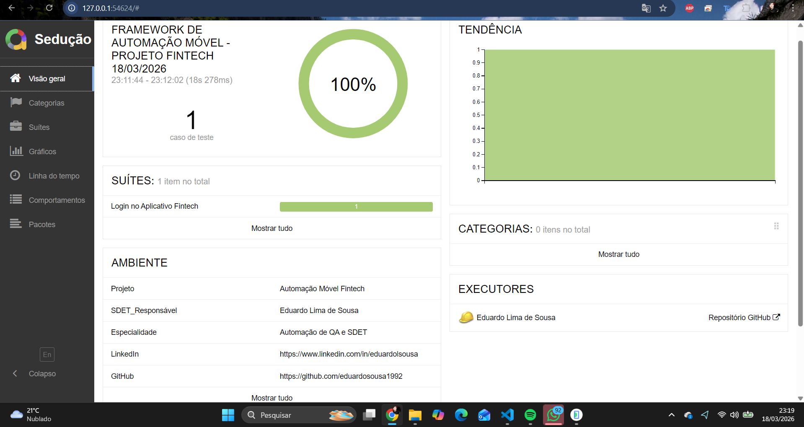

# 📱 Mobile Automation Framework - Fintech Project 🚀

> **Unified Quality Framework (UQF)** | Solução de Engenharia de Qualidade desenvolvida para garantir resiliência, estabilidade e observabilidade em ecossistemas financeiros de alta criticidade.

---

## 👨‍💻 Estrategista de Qualidade: Eduardo Lima de Sousa
**Senior QA Automation Engineer (SDET)**
*Especialista em Confiabilidade de Sistemas Financeiros | GFT & Bradesco*

---

## 📊 Observabilidade e Inteligência de Dados (Allure Report)

Este framework não apenas executa testes; ele gera **Insights de Negócio**. Através da integração com **Allure Framework** e **AspectJ Weaver**, entregamos uma camada de observabilidade que reduz drasticamente o MTTR (*Mean Time To Repair*).

### 🛡️ Diferenciais de Governança e Qualidade:
- **Evidências Step-by-Step:** Captura automática de screenshots para cada interação (Behavior-Driven Evidence).
- **Injeção de Metadados Profissionais:** Identificação nativa de Executor (Eduardo Sousa), Ambiente e Versão de Infraestrutura no Report.
- **Análise de Tendência (Trend Lines):** Monitoramento histórico para identificação de degradação de performance entre builds.
- **Categorização de Falhas:** Separação lógica entre Bugs do Aplicativo e Instabilidades de Infraestrutura.

---

## 🏗️ Arquitetura e Decisões de Engenharia (ADR)

Seguindo o rigor de arquitetura de software, as decisões deste projeto são documentadas via **Architecture Decision Records (ADR)**.

📂 [**ADR 001: Implementação de Observabilidade Nativa**](./docs/adr/ADR-001-Observabilidade-Allure.md)
*Reflete a decisão de priorizar a rastreabilidade e evidências visuais em conformidade com auditorias bancárias.*

---

## 🛠️ Stack Tecnológica & Ecossistema

| Componente | Tecnologia | Finalidade |
| :--- | :--- | :--- |
| **Linguagem** | Java 17 | Robustez e tipagem forte para sistemas escaláveis. |
| **Engine** | Appium 2.x | Interação nativa com drivers Android (UiAutomator2). |
| **BDD** | Cucumber 7.x | Alinhamento de regras de negócio com execução técnica. |
| **Reporting** | Allure Report | Dashboards executivos e visibilidade de qualidade. |
| **Dependency** | Maven | Gestão de ciclo de vida e build. |
| **Documentation** | ADR & Markdown | Governança técnica e transferência de conhecimento. |

---

## 🚀 Guia de Execução (Rigor de SDET)

### Pré-requisitos:
- Android SDK (API 33+)
- Appium Server 2.x ativo
- Java JDK 17 configurado

### Execução Completa:
1. **Rodar Testes e Gerar Evidências:**
   \\\powershell
   mvn test
   \\\
2. **Injetar Metadados e Categorias:**
   \\\powershell
   cp src/test/resources/allure-metadata/* target/allure-results/
   \\\
3. **Gerar Relatório de Tendência:**
   \\\powershell
   allure serve target/allure-results
   \\\

---

## 🏛️ Sobre o Autor e Background Acadêmico

Eduardo Lima de Sousa integra fundamentos de **Engenharia de Software (USP/ESALQ)**, **Segurança da Informação (UNINOVE)** e **Digital Business (ESPM)** para construir soluções que conectam Qualidade, Segurança e Impacto de Negócio. Com mais de 5 anos de experiência, foca na evolução do QA tradicional para uma visão de **Arquitetura de Qualidade Estratégica**.

---
*Documento gerado automaticamente como parte da Governança do Projeto Unified Quality Framework.*
